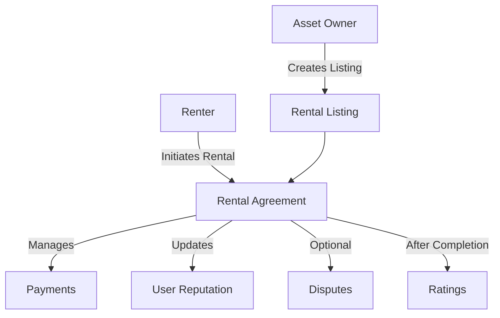

# DynaRent Rental Protocol

A decentralized protocol for peer-to-peer rental agreements on the Stacks blockchain, enabling secure and automated rental management with built-in payment processing and contract enforcement.

## Overview

DynaRent enables asset owners to create rental listings with customizable terms and allows renters to engage in trustless rental agreements. The protocol handles:

- Rental listing creation and management
- Automated payment processing and escrow
- Dispute resolution and reputation tracking
- Rental extensions and early terminations
- Security deposits and refunds

## Architecture



The protocol consists of several key components:
- Rental listings with customizable terms
- Active rental agreements with payment tracking
- Reputation system for users
- Rating system for completed rentals
- Payment processing with automated escrow

## Contract Documentation

### Core Contract (`dynarent-core`)

#### State Management
- `rental-listings`: Tracks all rental listings
- `rental-agreements`: Manages active and historical rentals
- `rental-payments`: Records all payment transactions
- `user-reputation`: Stores user reputation data
- `rental-ratings`: Maintains rental ratings and reviews

#### Key Functions

**Listing Management**
- `create-listing`: Create new rental listing
- `update-listing`: Modify existing listing details

**Rental Operations**
- `rent-asset`: Initiate rental agreement
- `complete-rental`: Complete rental normally
- `terminate-rental`: End rental early
- `extend-rental`: Extend rental duration

**Dispute Handling**
- `open-dispute`: File dispute for active rental
- `resolve-dispute`: Resolve dispute (admin only)

## Getting Started

### Prerequisites
- Clarinet
- Stacks wallet
- STX tokens for transactions

### Basic Usage

1. Create a rental listing:
```clarity
(contract-call? .dynarent-core create-listing 
    "Mountain Bike" 
    "High-end mountain bike for rent" 
    none 
    u100000 ;; Rate in µSTX
    u2 ;; Daily rate
    u1000000 ;; Deposit
    none 
    u24 ;; Min duration (hours)
    u168 ;; Max duration (hours)
    "Standard rental terms..."
)
```

2. Rent an asset:
```clarity
(contract-call? .dynarent-core rent-asset 
    u1 ;; listing-id
    u72 ;; duration in hours
)
```

## Function Reference

### Listing Management

```clarity
(create-listing (name (string-ascii 100))
                (description (string-utf8 500))
                (image-url (optional (string-utf8 200)))
                (rate-amount uint)
                (rate-schedule uint)
                (deposit-amount uint)
                (insurance-amount (optional uint))
                (min-duration uint)
                (max-duration uint)
                (terms (string-utf8 1000)))
```

### Rental Operations

```clarity
(rent-asset (listing-id uint) (duration uint))
(complete-rental (rental-id uint))
(extend-rental (rental-id uint) (additional-time uint))
```

## Development

### Testing
Run tests with Clarinet:
```bash
clarinet test
```

### Local Development
1. Start Clarinet console:
```bash
clarinet console
```

2. Deploy contracts:
```bash
clarinet deploy
```

## Security Considerations

1. **Payment Handling**
   - All payments are processed through escrow
   - Deposits are locked until rental completion
   - Refunds are calculated based on actual usage

2. **Access Control**
   - Function-level authorization checks
   - Only owners can modify their listings
   - Only participants can modify their rentals

3. **Dispute Resolution**
   - Two-party dispute system
   - Admin-controlled resolution process
   - Reputation tracking for accountability

4. **Rate Limiting**
   - Minimum and maximum duration enforcement
   - Validation of all numerical inputs
   - Status checks prevent invalid state transitions